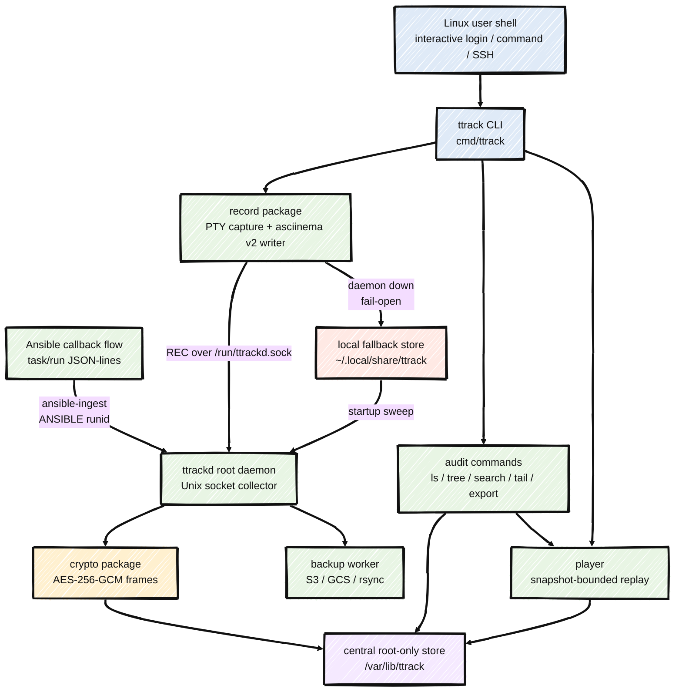

<div align="center">

# ttrack

Terminal session recorder and audit tool for Linux — captures every shell session, encrypts it at rest, and lets operators replay, search, and live-tail from a root-only central store.

[](https://github.com/rushikeshsakharleofficial/ttrack-tracker/actions)
[](https://github.com/rushikeshsakharleofficial/ttrack-tracker/releases)
[](LICENSE)
[](https://github.com/rushikeshsakharleofficial/ttrack-tracker/stargazers)
[](CONTRIBUTING.md)

</div>

---

## What is this?

`ttrack` is a command-line terminal session recorder for Linux. It runs a shell under a PTY, captures output as an [asciinema v2](https://docs.asciinema.org/manual/asciicast/v2/) cast file, and replays it with original timing. A companion root daemon, `ttrackd`, collects sessions from all users into a root-only central store (`/var/lib/ttrack`) so host activity can be reviewed and live-tailed for audit. It is a single static Go binary with no runtime dependencies.

## Table of contents

- [Features](#features)
- [Architecture flow](#architecture-flow)
- [Demo](#demo)
- [Installation](#installation)
- [Quick start](#quick-start)
- [Commands](#commands)
- [Audit mode (central root-only store)](#audit-mode-central-root-only-store)
- [Auto-record on login](#auto-record-on-login-optional)
- [Record non-interactive SSH](#record-non-interactive-ssh-optional)
- [Shell completion](#shell-completion)
- [Configuration](#configuration)
- [File format](#file-format)
- [Troubleshooting](#troubleshooting)
- [Building and packaging](#building-and-packaging)
- [Project structure](#project-structure)
- [Ansible tracking](#ansible-tracking)
- [Documentation](#documentation)
- [Contributing](#contributing)
- [License](#license)

## Features

- **Record & replay** any interactive shell session (`script(1)` / `asciinema`-style).
- **Full-screen player** for replay: a thin-line seek/progress bar, pause, variable speed, jump-to-command, mouse click-to-seek, and a bar toggle for full-height playback.
- **asciinema v2 cast** output (local recordings are inspectable JSON-lines and play with `asciinema play`; central recordings are encrypted — `export` them first).
- **Central audit store** via the `ttrackd` root daemon: all users' sessions in `/var/lib/ttrack`, `root:root 0700` — normal users cannot read recordings.
- **Encrypted at rest** — central recordings are AES-256-GCM encrypted; `cat`/`strings`/`grep` on a `.cast` reveal only ciphertext.
- **Live tail** an in-progress session (`ttrack tail -f <id>`, root); or show last N lines of any session (`ttrack tail [-n N] <id>`).
- **Unified commands**: `ttrack play` auto-detects local file or central session ID; `ttrack ls --all` / `--user <name>` covers both local and central listings.
- **Flexible search dates**: `--from`/`--to` accept any format `date -d` understands — `"yesterday"`, `"2 days ago"`, `"last week"`, or `"YYYY-MM-DD HH:MM"`.
- **Config file** at `/etc/ttrack/ttrack.conf` with all defaults visible; `ttrack --check` validates and prints resolved values.
- **Ansible tracking** — records playbook runs (plays, tasks, per-host status, output) on the controller via a callback plugin.
- **Auto-record on login** via an optional `profile.d` hook (skips nested `sudo su -`).
- **Fail-open**: if the daemon is down, recording falls back to a user-local file and is ingested into the central store when the daemon restarts.
- **Bash tab-completion** for subcommands, flags, sessions, and users.
- Ships as `rpm` and `deb` packages with a systemd unit.

## Architecture flow



Codebase map: `cmd/ttrack` dispatches the CLI, `internal/record` captures PTY output, `internal/cast` writes asciinema v2 JSON-lines, `internal/daemon` receives `REC`, `TAIL`, and `ANSIBLE` streams over the Unix socket, `internal/crypto` encrypts central data, `internal/store` resolves local/central paths and transparent decrypt, and `internal/audit`, `internal/play`, `internal/ansible`, and `internal/backup` provide the operator-facing read, replay, automation, and backup flows.

## Demo

```text
$ ttrack --help
ttrack — Linux terminal session tracker

usage:
  ttrack rec [-q] [-o file] [cmd...]      record a shell session (default: $SHELL)
  ttrack play [--speed N] <file|id>       replay local file or central session (auto-detect)
  ttrack ls                               list local recordings
  ttrack ls --all                         list all users in central store (root)
  ttrack ls --user <name>                 list one user's sessions in central store (root)

audit commands (central root-only store):
  ttrack tail [-n N] <id>                 show last N lines of a session (default 20)
  ttrack tail -f <id>                     live-stream an in-progress session (root)
  ttrack tree                             users -> sessions tree (root)
  ttrack search [opts] <string>           find a string across recordings (root)
  ttrack export [-o file] <id>            decrypt a session to a plaintext cast (root)
  ttrack prune                            interactively delete recordings (root)
  ttrack ansible list [--user U]          list Ansible playbook runs (root)
  ttrack ansible show <runid>             show tasks and recap for a run (root)

  ttrack completion bash                  print the bash completion script
  ttrack version                          print version
  ttrack --check                          validate config and show resolved values

search opts: --from / --to <any 'date -d' format>, --user <name>, -i
recordings in the central store are encrypted at rest (opaque to cat/strings)

local recordings: $TTRACK_DIR or ~/.local/share/ttrack
central store:    $TTRACK_CENTRAL_DIR or /var/lib/ttrack (root:root 0700)
format: asciinema v2 cast (.cast) — also playable with `asciinema play`

run 'ttrack help <command>' (or 'ttrack <command> --help') for command details
```

> Run `ttrack help <command>` for detailed per-command help (options and, for `play`, the full list of player controls).

## Requirements

- Linux (uses `/proc` and `SO_PEERCRED`).
- To build from source: Go 1.25.

## Installation

### From a released package

Every push to `main` publishes an `rpm`, a `deb`, and a static binary on the [releases page](https://github.com/rushikeshsakharleofficial/ttrack-tracker/releases). Download the current version directly:

**Debian / Ubuntu (.deb):**

```bash
VER=$(curl -fsSL https://api.github.com/repos/rushikeshsakharleofficial/ttrack-tracker/releases/latest | grep -oP '"tag_name":\s*"v\K[^"]+')
curl -fLO "https://github.com/rushikeshsakharleofficial/ttrack-tracker/releases/download/v${VER}/ttrack_${VER}_amd64.deb"
sudo apt install "./ttrack_${VER}_amd64.deb"
```

**RHEL / Rocky / AlmaLinux / Fedora (.rpm):**

```bash
VER=$(curl -fsSL https://api.github.com/repos/rushikeshsakharleofficial/ttrack-tracker/releases/latest | grep -oP '"tag_name":\s*"v\K[^"]+')
curl -fLO "https://github.com/rushikeshsakharleofficial/ttrack-tracker/releases/download/v${VER}/ttrack-${VER}-1.x86_64.rpm"
sudo dnf install "./ttrack-${VER}-1.x86_64.rpm"
```

**Static binary (any distro):**

```bash
VER=$(curl -fsSL https://api.github.com/repos/rushikeshsakharleofficial/ttrack-tracker/releases/latest | grep -oP '"tag_name":\s*"v\K[^"]+')
curl -fL -o ttrack "https://github.com/rushikeshsakharleofficial/ttrack-tracker/releases/download/v${VER}/ttrack-${VER}-linux-amd64"
chmod +x ttrack && sudo install -m755 ttrack /usr/bin/ttrack
```

> **Note:** CI publishes a new release on every push to `main`. The commands above always fetch the latest.

Packages install `ttrack` to `/usr/bin`, the `ttrackd` daemon to `/usr/libexec`, a systemd unit, the bash completion, and the auto-record login hook. The post-install step creates `/var/lib/ttrack` (root-only), creates `/var/log/ttrack` for daemon logs, writes `/etc/ttrack/ttrack.conf` with all defaults visible, and enables `ttrackd`.

### From source

```bash
git clone https://github.com/rushikeshsakharleofficial/ttrack-tracker.git
cd ttrack-tracker
make build          # builds bin/ttrack and bin/ttrackd
sudo make install   # installs binaries, man page, systemd unit, completion
```

## Quick start

Record a session, list it, and replay it:

```text
$ ttrack rec /bin/bash -c 'echo "hello from ttrack"; uname -sr'
ttrack: recording to /home/alice/.local/share/ttrack/20260526T145029-1413696.cast — type 'exit' or Ctrl-D to stop
hello from ttrack
Linux 5.14.0-611.55.1.el9_7.x86_64

ttrack: session saved to /home/alice/.local/share/ttrack/20260526T145029-1413696.cast

$ ttrack ls
STATUS   FILE                          STARTED              DURATION   COMMAND
SAVED    20260526T145029-1413696.cast  2026-05-26 14:50:29  2s         /bin/bash -c echo "hello from ttrack"; uname -sr

$ ttrack play --speed 100 20260526T145029-1413696.cast
--- ttrack replay start ---
hello from ttrack
Linux 5.14.0-611.55.1.el9_7.x86_64
--- ttrack replay end ---
```

With no command, `ttrack rec` records your `$SHELL` interactively until you `exit`.

## Commands

### Personal commands

| Command | Description |
|:--------|:------------|
| `ttrack rec [-q] [-o file] [cmd...]` | Record a session. Runs `$SHELL` (fallback `/bin/bash`) with no command. |
| `ttrack play [--speed N] [--idle N] <file\|id>` | Replay a recording. Auto-detects: existing local file → local play; otherwise → central store session ID (requires root). |
| `ttrack ls` | List local recordings (`STATUS`, `FILE`, `STARTED`, `DURATION`, `COMMAND`). |
| `ttrack ls --all` | List all users in the central store with session counts (root). |
| `ttrack ls --user <name>` | List one user's sessions in central store (root). |
| `ttrack --check` | Validate `/etc/ttrack/ttrack.conf` and print all resolved values. |
| `ttrack completion bash` | Print the bash completion script. |
| `ttrack help [command]` | Overall usage, or one command's detailed help. |

`rec` flags: `-o <file>` writes a local file at that path; `-q` (or `TTRACK_QUIET=1`) suppresses the recording banner and saved-path message.

`play` flags: `--speed N` playback multiplier (default `1.0`); `--idle N` caps idle gaps to N seconds — default `0` = exact original timing.

**Player UI.** On a terminal, `play` opens a full-screen player (alternate screen):

```
 > 01:23 / 05:00 [####      ]  27%  1x   <-/-> seek  pgup scroll  g goto  spc play  q quit
```

Controls:

| Key / action | Effect |
|:----|:-------|
| `space` | Pause / resume |
| `→` / `←` | Seek forward / backward 5 s |
| `↑` / `↓` | Double / halve playback speed (range: 1/64× – 64×) |
| `g` | Go to time — type `MM:SS` or seconds, Enter to jump |
| `pgup` | Enter scroll view — browse past output a page at a time |
| click the bar | Seek to that point (Shift+click selects text instead) |
| `b` | Hide/show the status bar |
| `0` | Restart from the beginning |
| `q` / `Ctrl-C` | Quit |

### Audit commands (root)

These read the central root-only store and require root:

| Command | Description |
|:--------|:------------|
| `ttrack ls --all` | List all users and their session counts. |
| `ttrack ls --user <name>` | List a user's sessions (STATUS, TYPE, SESSION, STARTED, DURATION, COMMAND). |
| `ttrack play <sessionid>` | Replay a session by id, searched across all users (auto-detect). |
| `ttrack tail [-n N] <id>` | Show last N lines of a session's recorded output (default 20). |
| `ttrack tail -f <id>` | Live-stream an in-progress session from the daemon. |
| `ttrack tree` | Print a users → sessions tree. |
| `ttrack search [--from T] [--to T] [--user U] [-i] <pattern>` | Find a string across recordings. `--from`/`--to` accept any `date -d` format. |
| `ttrack export [-o file] <id>` | Decrypt a recording to a plaintext asciinema cast. |
| `ttrack prune [--yes]` | Interactively delete recordings by user and time. |

## Audit mode (central root-only store)

When `ttrackd` runs (it does after package install), `ttrack rec` streams the cast
to it over `/run/ttrackd.sock` and the recording is written by root to
`/var/lib/ttrack/<user>/<sessionid>.cast` (`root:root 0600`, dirs `0700`). Normal
users cannot read other users' — or their own — recordings.

```text
$ sudo ttrack ls --all
USER                  SESSIONS   LAST ACTIVE
root                  1          2026-05-28 17:09
alice                 7          2026-05-27 14:03

$ sudo ttrack ls --user alice
STATUS   TYPE             SESSION                       STARTED              DURATION   COMMAND
SAVED    non-interactive  20260526T145020-1413240.cast  2026-05-26 14:50:19  3s         /bin/bash -c echo deploy-step-1; whoami

$ sudo ttrack tree
/var/lib/ttrack
├─ root
│  └─ 20260526T124229-1909275.cast  [SAVED interactive]  2026-05-26 12:42:29  17m28s  /bin/bash
└─ alice
   └─ 20260526T145020-1413240.cast  [SAVED non-interactive]  2026-05-26 14:50:19  3s  /bin/bash -c echo deploy-step-1; whoami
```

The `TYPE` column distinguishes an **interactive** login shell from a **non-interactive** command session. `DURATION` is the recorded length; an in-progress session shows elapsed-so-far with a trailing `+`.

Search recordings for a string, with flexible date filtering:

```text
$ sudo ttrack search nginx
user=alice  when=2026-05-26 14:59:18  session=20260526T145918-1420180
    cmd: /bin/bash -c echo starting deploy; systemctl restart nginx; echo deploy done
    > Failed to restart nginx.service: Unit nginx.service not found.

$ sudo ttrack search --from "2 days ago" --to yesterday --user alice -i DEPLOY
user=alice  when=2026-05-26 14:59:18  session=20260526T145918-1420180
    cmd: /bin/bash -c echo starting deploy; ...
```

`--from`/`--to` accept any format the system `date -d` command understands: `"yesterday"`, `"2 days ago"`, `"last week"`, `"2026-05-28"`, `"2026-05-28 17:00"`.

Show the tail of a completed session, or watch a live one:

```bash
sudo ttrack tail alice/20260526T145020-1413240.cast      # last 20 lines
sudo ttrack tail -n 50 20260526T145020-1413240.cast     # last 50 lines
sudo ttrack tail -f 20260526T145020-1413240.cast        # live stream
```

Delete old recordings interactively:

```text
$ sudo ttrack prune
Users with recordings: alice, root
Prune which user? [all / <username>] alice
What to delete:
  all              every session for the selected user(s)
  days N           sessions older than N days
  range FROM TO    sessions started in [FROM, TO]
Selection? days 90

Will delete 4 session(s), 2.1 MiB total:
  alice/20260101T...cast
  ...
Delete these 4 session(s)? [yes/NO] yes
pruned 4 session(s), freed 2.1 MiB
```

### Encryption at rest

Central recordings are encrypted with AES-256-GCM. On disk a `.cast` is opaque —
`cat`, `strings`, and `grep` show only ciphertext. `ttrack` decrypts transparently
for `play`, `search`, `tail`, and `export` using the key at
`/var/lib/ttrack/.ttrack.key` (`root:root 0600`), created by the daemon on first run.

```text
$ sudo strings /var/lib/ttrack/alice/20260526T151022-1426734.cast | head -1
TTEC1                          # magic prefix; the rest is ciphertext

$ sudo ttrack export -o session.cast 20260526T151022-1426734
exported plaintext cast to session.cast      # now asciinema-compatible
```

The key is **unique per server** and set **immutable** (`chattr +i`): it cannot be deleted, renamed, or modified by `rm`/`vi`/`sed`/`>`/`tee` — even by root — until someone runs `chattr -i`.

> **Back up `/var/lib/ttrack/.ttrack.key`** — if it is lost, every encrypted recording is permanently unreadable. The daemon refuses to start if the key is missing while encrypted recordings exist.

**Integrity note:** this provides root-only access to recordings plus live tail. It is not tamper-proof against a malicious user who could avoid `ttrack` entirely. Non-circumventable capture requires PAM- or kernel-stage hooks, which this project does not implement.

**Fail-open:** if the daemon is unreachable, `ttrack rec` records to the user-local directory; on its next startup `ttrackd` ingests those files into the central store.

## Auto-record on login (optional)

The package installs a `profile.d` hook that records every interactive login and logs
out when the recorded shell exits. To enable manually:

```bash
sudo install -m644 scripts/profile.d/ttrack-autorec.sh /etc/profile.d/ttrack-autorec.sh
```

The hook only triggers for interactive shells with a real TTY, skips when `ttrack` is absent, and skips nested shells (`sudo su -`, `su -`, subshells) by detecting a `ttrack` process in the ancestry. It is fail-open: if the recorder cannot start, a normal shell continues. Remove the file to disable.

## Record non-interactive SSH (optional)

The login hook records interactive sessions only. To also record **non-interactive** SSH commands (`ssh host "cmd"`), enable the sshd `ForceCommand` wrapper. The package installs it automatically if `/etc/ssh/sshd_config.d/` exists (and adds the `Include` directive to the main `sshd_config` if needed). To enable manually:

```bash
sudo cp /usr/share/doc/ttrack/sshd-forcecommand.conf.example \
        /etc/ssh/sshd_config.d/zz-ttrack.conf
sudo sshd -t && sudo systemctl reload ssh
```

- `scp` / `sftp` / `rsync` / git transfers pass through untouched.
- Interactive logins keep recording via the profile.d hook (no double-wrap).
- Fail-open: if anything is off, the command runs normally — SSH is never blocked.

Exclude an account with a `Match` block:

```text
Match User *,!adminuser
    ForceCommand /usr/libexec/ttrack-ssh-wrap
```

Disable by removing `/etc/ssh/sshd_config.d/zz-ttrack.conf` and reloading sshd.

## Shell completion

Bash completion is installed by the package to `/usr/share/bash-completion/completions/ttrack`. To enable manually:

```bash
ttrack completion bash | sudo tee /usr/share/bash-completion/completions/ttrack
```

It completes subcommands, flags, local sessions (for `play`), and — when run as root — users and central session ids.

## Configuration

ttrack reads `/etc/ttrack/ttrack.conf` on startup (override path with `TTRACK_CONFIG`). The file ships with all defaults active (uncommented) so it is immediately editable. Validate with:

```bash
ttrack --check
```

Output:

```
ttrack: reading config from /etc/ttrack/ttrack.conf
socket_path            = /run/ttrackd.sock
central_dir            = /var/lib/ttrack
key_file               = .ttrack.key  (resolved: /var/lib/ttrack/.ttrack.key)
dial_timeout_sec       = 1s
eof_grace_ms           = 500ms
ansible_output_cap     = 8192
scroll_buffer          = 32768
log_level              = 3  (0=off 1=error 2=warn 3=info 4=debug 5=trace)
log_file               = /var/log/ttrack/ttrack.log
ttrack: config OK
```

### Config keys

| Key | Default | Env override | Purpose |
|:----|:--------|:------------|:--------|
| `socket_path` | `/run/ttrackd.sock` | `TTRACKD_SOCK` | Daemon Unix socket |
| `central_dir` | `/var/lib/ttrack` | `TTRACK_CENTRAL_DIR` | Root of central session store |
| `key_file` | `.ttrack.key` | `TTRACK_KEY_FILE` | Encryption key path (relative to `central_dir` or absolute) |
| `dial_timeout_sec` | `1` | `TTRACK_DIAL_TIMEOUT_SEC` | Seconds to wait when connecting to daemon |
| `eof_grace_ms` | `500` | `TTRACK_EOF_GRACE_MS` | Ms before force-closing PTY on stdin EOF |
| `ansible_output_cap` | `8192` | `TTRACK_ANSIBLE_OUTPUT_CAP` | Max bytes stored per Ansible task output |
| `scroll_buffer` | `32768` | `TTRACK_SCROLL_BUFFER` | PTY read buffer size in bytes (min 4096) |
| `log_level` | `3` | `TTRACK_LOG_LEVEL` | Daemon log verbosity (`0` off through `5` trace) |
| `log_file` | `/var/log/ttrack/ttrack.log` | `TTRACK_LOG_FILE` | Daemon logfile path; empty disables file logging |

Restart `ttrackd` after editing: `sudo systemctl restart ttrackd`.

### Environment variables

| Variable | Default | Used by | Description |
|:---------|:--------|:--------|:------------|
| `TTRACK_DIR` | `~/.local/share/ttrack` | `ttrack` | User-local recordings dir (fail-open fallback + local `ls`/`play`). |
| `TTRACK_QUIET` | unset | `ttrack rec` | Any non-empty value suppresses the banner + saved-path message. |
| `SHELL` | `/bin/bash` | `ttrack rec` | Shell launched when no command is given. |

### Filesystem layout

| Path | Owner / mode | Purpose |
|:-----|:-------------|:--------|
| `/usr/bin/ttrack` | `root 0755` | CLI |
| `/usr/libexec/ttrackd` | `root 0755` | daemon |
| `/etc/ttrack/ttrack.conf` | `root 0644` | runtime config (conffile — preserved on upgrade) |
| `/var/lib/ttrack/` | `root:root 0700` | central store |
| `/var/lib/ttrack/<user>/<id>.cast` | `root:root 0600` | encrypted recording |
| `/var/lib/ttrack/.ttrack.key` | `root:root 0600`, `chattr +i` | per-server AES key (immutable) |
| `/var/log/ttrack/` | `root:root 0750` | daemon log directory |
| `/var/log/ttrack/ttrack.log` | `root:root 0640` | daemon logfile |
| `/run/ttrackd.sock` | `root 0666` | recorder connect socket |
| `/etc/profile.d/ttrack-autorec.sh` | `root 0644` | optional auto-record login hook |
| `~/.local/share/ttrack/` | the user | local fail-open recordings |

### Daemon service

```bash
sudo systemctl status ttrackd
sudo systemctl restart ttrackd
sudo tail -f /var/log/ttrack/ttrack.log
sudo journalctl -u ttrackd --no-pager
```

To override settings at the systemd level (takes precedence over config file):

```bash
sudo systemctl edit ttrackd
# [Service]
# Environment=TTRACK_CENTRAL_DIR=/srv/ttrack
```

## File format

Recordings are asciinema v2 cast files (UTF-8, JSON-lines):

```text
{"version":2,"width":80,"height":24,"timestamp":1779776263,"command":"/bin/bash","env":{"SHELL":"/bin/bash","TERM":"xterm-256color"}}
[0.131000, "o", "hello\r\n"]
```

The first line is a header; each subsequent line is `[time_seconds, "o", data]`.
Local (plaintext) recordings are viewable with `asciinema cat` and playable with
`asciinema play`. Central recordings are encrypted — run `ttrack export` first.

## Troubleshooting

**`ttrack --check` shows config file not found.** The daemon still uses built-in defaults. Install the package to get `/etc/ttrack/ttrack.conf`, or create it manually by copying `/usr/share/ttrack/ttrack.conf.example`.

**`ttrack` hangs or does not record.** Check the daemon:

```bash
sudo systemctl status ttrackd
sudo tail -n 100 /var/log/ttrack/ttrack.log
sudo journalctl -u ttrackd --since '5 min ago' --no-pager
```

If the daemon is stopped, `ttrack rec` still works (fail-open: saves to `~/.local/share/ttrack`). Start `ttrackd` and those files are ingested on next start.

**`ttrack play` says "no such session".** The argument is treated as a central store session ID when no local file matches. Run `sudo ttrack ls --all` to list available IDs, or pass the full local file path.

**Replaying a full-screen app (vim, less, htop) looks fine.** `ttrack play` reproduces TUI redraws exactly. Multibyte/box-drawing characters survive even when a PTY read splits a rune across chunks.

**Scroll view shows garbled lines.** The scrollback viewer (`pgup` during replay) parses terminal output heuristically. Cursor-movement sequences are treated as line breaks. Full-screen TUIs may look approximate in scroll view, but the main player renders them exactly.

**`man ttrack` shows an old version.** A manual install may have left a stale man page at `/usr/local/man/man1/ttrack.1`. Remove it:

```bash
sudo rm -f /usr/local/man/man1/ttrack.1
man ttrack
```

## Building and packaging

```bash
make build          # bin/ttrack and bin/ttrackd (static, CGO disabled)
make test           # run unit tests
make rpm            # build an rpm into release/
make deb            # build a deb into release/
make packages       # both
make VERSION=1.2.3 packages
```

Packaging uses [`nfpm`](https://github.com/goreleaser/nfpm) (`go install` it first).

**Releases are automated.** Every push to `main` runs the `Auto Release` workflow, which bumps the patch version from the latest tag and publishes a GitHub Release with `rpm`, `deb`, the static binary, and `SHA256SUMS`.

```bash
make test           # unit tests (go test ./...)
```

## Project structure

```
cmd/
  ttrack/           CLI (rec/play/ls/tail/tree/search/export/ansible/--check)
  ttrackd/          root collector daemon
docs/
  superpowers/
  wiki/
internal/
  ansible/          Ansible tracking (model, ingest, commands)
  audit/            root-only audit commands
  auth/
  backup/
  cast/             asciinema v2 cast read/write
  complete/         shell completion
  config/           runtime config file parser + singleton
  crypto/           at-rest AES-256-GCM encryption (+ tests)
  daemon/           ttrackd socket server, live tail fan-out, ingest, key mgmt
  initcmd/
  logger/
  play/             replay (snapshot-bounded)
  record/           PTY capture for `ttrack rec`
  store/            storage paths + transparent decrypt
man/
  ttrack.1          man page
packaging/
  postinstall.sh
  postremove.sh
  preremove.sh
scripts/
  ansible/
  profile.d/
  systemd/
CONTRIBUTING.md
LICENSE
Makefile
go.mod
nfpm.yaml
```

## Ansible tracking

ttrack records Ansible playbook runs on the **controller** host (the machine running `ansible-playbook`). Each task — its name, module, host, status (`ok`/`changed`/`failed`/`unreachable`/`skipped`), output, and rc — is captured and stored encrypted in the central store.

### Enable the callback plugin

**Via environment variables (per-run):**
```bash
export ANSIBLE_CALLBACK_PLUGINS=/usr/share/ttrack/ansible
export ANSIBLE_CALLBACKS_ENABLED=ttrack
ansible-playbook site.yml
```

**Via `ansible.cfg` (persistent):**
```ini
[defaults]
callback_plugins  = /usr/share/ttrack/ansible
callbacks_enabled = ttrack
```

The plugin is installed at `/usr/share/ttrack/ansible/ttrack.py` by the deb/rpm packages.

### Browse runs

```bash
sudo ttrack ansible list
sudo ttrack ansible show <runid>
```

Example `ttrack ansible list`:

```
RUN                           PLAYBOOK             CONTROLLER   OK     CHG    FAIL   STARTED              HOSTS
20260527T140300-12345         deploy.yml           ctrl.host    8      3      1      2026-05-27 14:03:00  web1,web2
```

Example `ttrack ansible show 20260527T140300-12345`:

```
Playbook : deploy.yml
Run ID   : 20260527T140300-12345

PLAY [Install web server]
  ✓ web1          install nginx            (ansible.builtin.dnf) @14:03:01
  ✗ web2          fail intentionally       (ansible.builtin.command) @14:03:03
      stderr: command not found
      rc: 1

PLAY RECAP
  web1                 ok=8    changed=3    failed=1    unreachable=0    skipped=0
```

### Fail-open

If `ttrackd` is unreachable, the run is saved to `~/.local/share/ttrack/ansible/<runid>.ajsonl`. The playbook run is **never aborted** due to ttrack failures.

### Limitation

Only controllers with `ttrack` installed produce Ansible records. Managed hosts still receive raw Ansible SSH execs (captured by the sshd `ForceCommand` wrapper if configured, but those carry no task name or status).

## Documentation

| Resource | Description |
|:---------|:------------|
| [README](README.md) | This file — installation, quick start, full command reference |
| [CONTRIBUTING.md](CONTRIBUTING.md) | Bug reports, PR workflow, project layout, and test instructions |
| [man ttrack](man/ttrack.1) | Manual page — installed to `/usr/share/man/man1/ttrack.1` by packages |
| [LICENSE](LICENSE) | GNU General Public License v2.0 |
| [Releases](https://github.com/rushikeshsakharleofficial/ttrack-tracker/releases) | Pre-built `.rpm`, `.deb`, and static binaries |

## Contributing

ttrack is **100% open source** and community-driven — contributions of all sizes are welcome.

- **Found a bug or want a feature?** [Open an issue](https://github.com/rushikeshsakharleofficial/ttrack-tracker/issues).
- **Want to contribute code?** Fork, branch, and open a pull request. Run `make fmt`, `make vet`, `make test`, `make build` first — CI enforces all of them.

See [CONTRIBUTING.md](CONTRIBUTING.md) for the full guide (bug reports, PR workflow, project layout, tests).

<a href="https://github.com/rushikeshsakharleofficial/ttrack-tracker/graphs/contributors">
  
</a>

## License

Licensed under the GNU General Public License v2.0. See [LICENSE](LICENSE).

---

<div align="center">

[](https://star-history.com/#rushikeshsakharleofficial/ttrack-tracker&Date)
</div>
