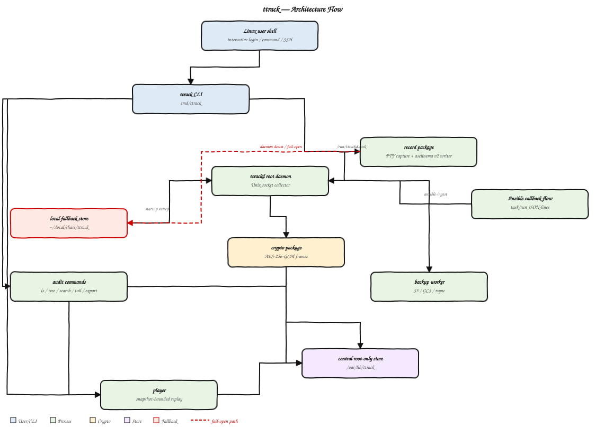

<div align="center">

# ttrack

Terminal session recorder and audit tool for Linux — captures every shell session, encrypts it at rest, and lets operators replay, search, and live-tail from a root-only central store.

[](https://github.com/rushikeshsakharleofficial/ttrack-tracker/actions)
[](https://github.com/rushikeshsakharleofficial/ttrack-tracker/releases)
[](LICENSE)
[](https://github.com/rushikeshsakharleofficial/ttrack-tracker/stargazers)
[](CONTRIBUTING.md)

</div>

---

## Table of contents

- [Architecture flow](#architecture-flow)
- [Installation](#installation)
- [Quick start](#quick-start)
- [Commands](#commands)
- [Audit mode](#audit-mode-central-root-only-store)
- [Optional integrations](#optional-integrations)
- [Configuration](#configuration)
- [Troubleshooting](#troubleshooting)
- [Building and packaging](#building-and-packaging)
- [Project structure](#project-structure)
- [Ansible tracking](#ansible-tracking)
- [Contributing](#contributing)
- [License](#license)

## Architecture flow



## Installation

Requires Linux (uses `/proc` and `SO_PEERCRED`). To build from source: Go 1.25.

**Debian / Ubuntu (.deb):**

```bash
VER=$(curl -fsSL https://api.github.com/repos/rushikeshsakharleofficial/ttrack-tracker/releases/latest | grep -oP '"tag_name":\s*"v\K[^"]+')
curl -fLO "https://github.com/rushikeshsakharleofficial/ttrack-tracker/releases/download/v${VER}/ttrack_${VER}_amd64.deb"
sudo apt install "./ttrack_${VER}_amd64.deb"
```

**RHEL / Rocky / AlmaLinux / Fedora (.rpm):**

```bash
VER=$(curl -fsSL https://api.github.com/repos/rushikeshsakharleofficial/ttrack-tracker/releases/latest | grep -oP '"tag_name":\s*"v\K[^"]+')
curl -fLO "https://github.com/rushikeshsakharleofficial/ttrack-tracker/releases/download/v${VER}/ttrack-${VER}-1.x86_64.rpm"
sudo dnf install "./ttrack-${VER}-1.x86_64.rpm"
```

**Static binary (any distro):**

```bash
VER=$(curl -fsSL https://api.github.com/repos/rushikeshsakharleofficial/ttrack-tracker/releases/latest | grep -oP '"tag_name":\s*"v\K[^"]+')
curl -fL -o ttrack "https://github.com/rushikeshsakharleofficial/ttrack-tracker/releases/download/v${VER}/ttrack-${VER}-linux-amd64"
chmod +x ttrack && sudo install -m755 ttrack /usr/bin/ttrack
```

**From source:**

```bash
git clone https://github.com/rushikeshsakharleofficial/ttrack-tracker.git
cd ttrack-tracker
make build        # builds bin/ttrack and bin/ttrackd
sudo make install # installs binaries, man page, systemd unit, completion
```

Packages install `ttrack` to `/usr/bin`, `ttrackd` to `/usr/libexec`, a systemd unit, bash completion, and the auto-record login hook. The post-install step creates `/var/lib/ttrack` (root-only), `/var/log/ttrack`, writes `/etc/ttrack/ttrack.conf`, and enables `ttrackd`.

## Quick start

```text
$ ttrack rec /bin/bash -c 'echo "hello from ttrack"; uname -sr'
ttrack: recording to /home/alice/.local/share/ttrack/20260526T145029-1413696.cast
hello from ttrack
Linux 5.14.0-611.55.1.el9_7.x86_64
ttrack: session saved

$ ttrack ls
STATUS   FILE                          STARTED              DURATION   COMMAND
SAVED    20260526T145029-1413696.cast  2026-05-26 14:50:29  2s         /bin/bash -c ...

$ ttrack play --speed 100 20260526T145029-1413696.cast
```

With no command, `ttrack rec` records your `$SHELL` interactively until you `exit`.

## Commands

### Personal

| Command | Description |
|:--------|:------------|
| `ttrack rec [-q] [-o file] [cmd...]` | Record a session. Runs `$SHELL` with no command. |
| `ttrack play [--speed N] [--idle N] <file\|id>` | Replay local file or central session (auto-detect). |
| `ttrack ls` | List local recordings. |
| `ttrack ls --all` | List all users in central store (root). |
| `ttrack ls --user <name>` | List one user's sessions in central store (root). |
| `ttrack --check` | Validate `/etc/ttrack/ttrack.conf` and print resolved values. |
| `ttrack completion bash` | Print bash completion script. |
| `ttrack help [command]` | Usage or per-command help. |

`rec` flags: `-o <file>` local output path; `-q` / `TTRACK_QUIET=1` suppresses banner.  
`play` flags: `--speed N` playback multiplier; `--idle N` caps idle gaps (default `0` = exact timing).

**Player controls** (full-screen, alternate-screen terminal):

| Key | Effect |
|:----|:-------|
| `space` | Pause / resume |
| `→` / `←` | Seek ±5 s |
| `↑` / `↓` | Double / halve speed (1/64× – 64×) |
| `g` | Go to time (`MM:SS` or seconds) |
| `pgup` | Scroll view |
| click bar | Seek to position |
| `b` | Toggle status bar |
| `0` | Restart |
| `q` / `Ctrl-C` | Quit |

### Audit (root)

| Command | Description |
|:--------|:------------|
| `ttrack ls --all` | List all users and session counts. |
| `ttrack ls --user <name>` | List a user's sessions. |
| `ttrack play <sessionid>` | Replay by session ID. |
| `ttrack tail [-n N] <id>` | Show last N lines (default 20). |
| `ttrack tail -f <id>` | Live-stream an in-progress session. |
| `ttrack tree` | Print users → sessions tree. |
| `ttrack search [--from T] [--to T] [--user U] [-i] <pattern>` | Search across recordings. |
| `ttrack export [-o file] <id>` | Decrypt recording to plaintext cast. |
| `ttrack prune [--yes]` | Interactively delete recordings. |

## Audit mode (central root-only store)

When `ttrackd` runs, `ttrack rec` streams the session over `/run/ttrackd.sock` to `/var/lib/ttrack/<user>/<id>.cast` (`root:root 0600`). Normal users cannot read recordings.

```bash
sudo ttrack ls --all
sudo ttrack ls --user alice
sudo ttrack tree
sudo ttrack search --from "2 days ago" --user alice nginx
sudo ttrack tail -f 20260526T145020-1413240.cast   # live stream
sudo ttrack export -o session.cast 20260526T151022  # decrypt to plaintext
```

`--from`/`--to` accept any `date -d` format: `"yesterday"`, `"2 days ago"`, `"last week"`, `"YYYY-MM-DD HH:MM"`.

**Encryption:** Central recordings are AES-256-GCM encrypted (`cat`/`strings` show only ciphertext). Key lives at `/var/lib/ttrack/.ttrack.key` (`root:root 0600`, `chattr +i` — immutable). Back it up — loss = unreadable recordings.

**Fail-open:** If daemon is unreachable, `ttrack rec` saves locally; `ttrackd` ingests on next start.

## Optional integrations

**Auto-record on login** — records every interactive login session:

```bash
sudo install -m644 scripts/profile.d/ttrack-autorec.sh /etc/profile.d/ttrack-autorec.sh
```

Skips nested shells (`sudo su -`), fails open. Remove the file to disable.

**Non-interactive SSH recording** — captures `ssh host "cmd"` commands:

```bash
sudo cp /usr/share/doc/ttrack/sshd-forcecommand.conf.example \
        /etc/ssh/sshd_config.d/zz-ttrack.conf
sudo sshd -t && sudo systemctl reload ssh
```

`scp`/`sftp`/`rsync`/git pass through untouched. Exclude accounts with a `Match` block. Remove `/etc/ssh/sshd_config.d/zz-ttrack.conf` to disable.

**Bash completion:**

```bash
ttrack completion bash | sudo tee /usr/share/bash-completion/completions/ttrack
```

## Configuration

Config file: `/etc/ttrack/ttrack.conf` (override with `TTRACK_CONFIG`). Validate:

```bash
ttrack --check
```

### Config keys

| Key | Default | Env override | Purpose |
|:----|:--------|:------------|:--------|
| `socket_path` | `/run/ttrackd.sock` | `TTRACKD_SOCK` | Daemon Unix socket |
| `central_dir` | `/var/lib/ttrack` | `TTRACK_CENTRAL_DIR` | Central session store |
| `key_file` | `.ttrack.key` | `TTRACK_KEY_FILE` | Encryption key path |
| `dial_timeout_sec` | `1` | `TTRACK_DIAL_TIMEOUT_SEC` | Daemon connect timeout |
| `eof_grace_ms` | `500` | `TTRACK_EOF_GRACE_MS` | PTY force-close delay on EOF |
| `ansible_output_cap` | `8192` | `TTRACK_ANSIBLE_OUTPUT_CAP` | Max bytes per Ansible task output |
| `scroll_buffer` | `32768` | `TTRACK_SCROLL_BUFFER` | PTY read buffer (min 4096) |
| `log_level` | `3` | `TTRACK_LOG_LEVEL` | Verbosity (0=off … 5=trace) |
| `log_file` | `/var/log/ttrack/ttrack.log` | `TTRACK_LOG_FILE` | Daemon logfile |

### Environment variables

| Variable | Default | Description |
|:---------|:--------|:------------|
| `TTRACK_DIR` | `~/.local/share/ttrack` | User-local recordings dir. |
| `TTRACK_QUIET` | unset | Suppress banner + saved-path message. |
| `SHELL` | `/bin/bash` | Shell launched when no command given. |

### Filesystem layout

| Path | Owner / mode | Purpose |
|:-----|:-------------|:--------|
| `/usr/bin/ttrack` | `root 0755` | CLI |
| `/usr/libexec/ttrackd` | `root 0755` | Daemon |
| `/etc/ttrack/ttrack.conf` | `root 0644` | Runtime config |
| `/var/lib/ttrack/` | `root:root 0700` | Central store |
| `/var/lib/ttrack/<user>/<id>.cast` | `root:root 0600` | Encrypted recording |
| `/var/lib/ttrack/.ttrack.key` | `root:root 0600`, `chattr +i` | AES key (immutable) |
| `/var/log/ttrack/ttrack.log` | `root:root 0640` | Daemon log |
| `/run/ttrackd.sock` | `root 0666` | Recorder socket |
| `~/.local/share/ttrack/` | user | Local fail-open recordings |

Restart daemon after config changes: `sudo systemctl restart ttrackd`

## Troubleshooting

**Config not found.** Package installs `/etc/ttrack/ttrack.conf`. Built-in defaults apply until then.

**ttrack hangs / no recording:**

```bash
sudo systemctl status ttrackd
sudo tail -n 100 /var/log/ttrack/ttrack.log
```

If daemon stopped, `rec` still works (fail-open). Start `ttrackd` to ingest queued files.

**"no such session".** Central ID not found — run `sudo ttrack ls --all` to list valid IDs.

**Stale man page:** `sudo rm -f /usr/local/man/man1/ttrack.1 && man ttrack`

## Building and packaging

```bash
make build                  # bin/ttrack + bin/ttrackd (static, CGO disabled)
make test                   # go test ./...
make rpm                    # release/*.rpm
make deb                    # release/*.deb
make packages               # both
make VERSION=1.2.3 packages
```

Packaging uses [`nfpm`](https://github.com/goreleaser/nfpm). Every push to `main` auto-releases via the `Auto Release` workflow.

## Project structure

```
cmd/
  ttrack/     CLI (rec/play/ls/tail/tree/search/export/ansible/--check)
  ttrackd/    root collector daemon
docs/
internal/
  ansible/    Ansible tracking
  audit/      root-only audit commands
  cast/       asciinema v2 read/write
  config/     runtime config
  crypto/     AES-256-GCM encryption
  daemon/     socket server, live tail, ingest, key management
  play/       snapshot-bounded replay
  record/     PTY capture
  store/      storage paths + transparent decrypt
man/
  ttrack.1
packaging/
scripts/
  ansible/
  profile.d/
  systemd/
```

## Ansible tracking

Records Ansible playbook runs on the **controller** host — plays, tasks, per-host status, output — encrypted in the central store.

**Enable:**

```bash
# per-run
export ANSIBLE_CALLBACK_PLUGINS=/usr/share/ttrack/ansible
export ANSIBLE_CALLBACKS_ENABLED=ttrack

# or persistent via ansible.cfg
[defaults]
callback_plugins  = /usr/share/ttrack/ansible
callbacks_enabled = ttrack
```

**Browse:**

```bash
sudo ttrack ansible list
sudo ttrack ansible show <runid>
```

If `ttrackd` is unreachable the run saves to `~/.local/share/ttrack/ansible/<runid>.ajsonl`. The playbook is never aborted due to ttrack failures.

## Contributing

Found a bug or want a feature? [Open an issue](https://github.com/rushikeshsakharleofficial/ttrack-tracker/issues).  
Contributing code? Fork → branch → PR. Run `make fmt vet test build` first.

See [CONTRIBUTING.md](CONTRIBUTING.md) for the full guide.

<a href="https://github.com/rushikeshsakharleofficial/ttrack-tracker/graphs/contributors">
  
</a>

## License

Licensed under the GNU General Public License v2.0. See [LICENSE](LICENSE).
